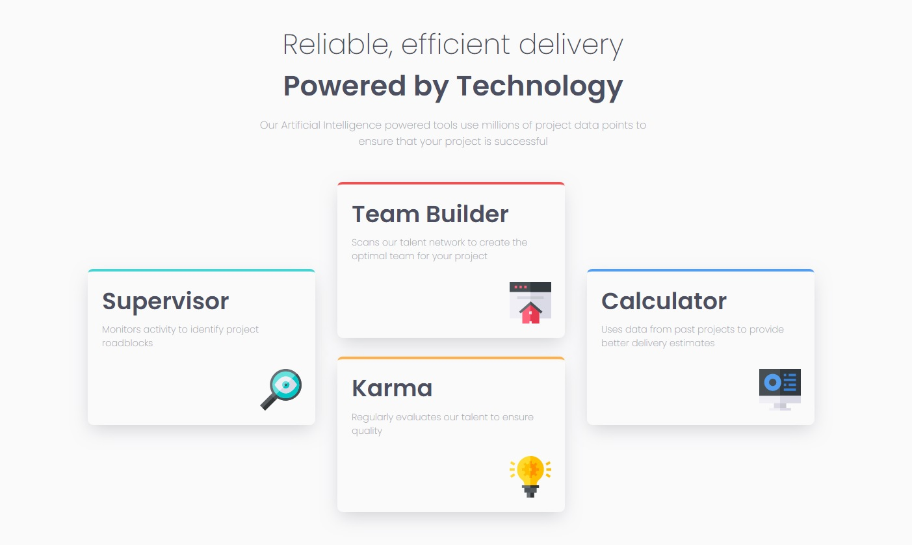

# Frontend Mentor - Four card feature section solution

This is a solution to the [Four card feature section challenge on Frontend Mentor](https://www.frontendmentor.io/challenges/four-card-feature-section-weK1eFYK).

## Table of contents


  - [The challenge](#the-challenge)
  - [Screenshot](#screenshot)
  - [Links](#links)
- [My process](#my-process)
  - [Built with](#built-with)
  - [What I learned](#what-i-learned)
  - [Continued development](#continued-development)
  - [Useful resources](#useful-resources)
- [Author](#author)
- [Acknowledgments](#acknowledgments)


### The challenge

Users should be able to:

- View the optimal layout for the site depending on their device's screen size

### Screenshot



### Links

- [ive Site URL](https://elvis-lr.github.io/four-card-feature-section/)


### Built with

- Semantic HTML5 markup
- CSS custom properties
- Flexbox
- CSS Grid
- Mobile-first workflow


### What I learned

```css
       .card{
            display: grid;
            grid-template-columns: repeat(3, 1fr);
            align-self: center;
            grid-template-areas: 
            "a b d"
            "a c d";
          
        }
        .tres{
           grid-area: c;
        }
        .cuatro{
            grid-row: -1/-3;
            align-self: center;
        }
        .uno{
            grid-row: 1/3;
            align-self: center;
      
        }
```
